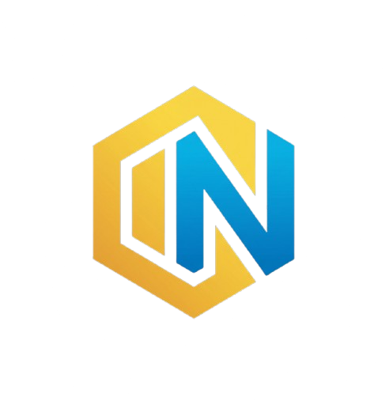
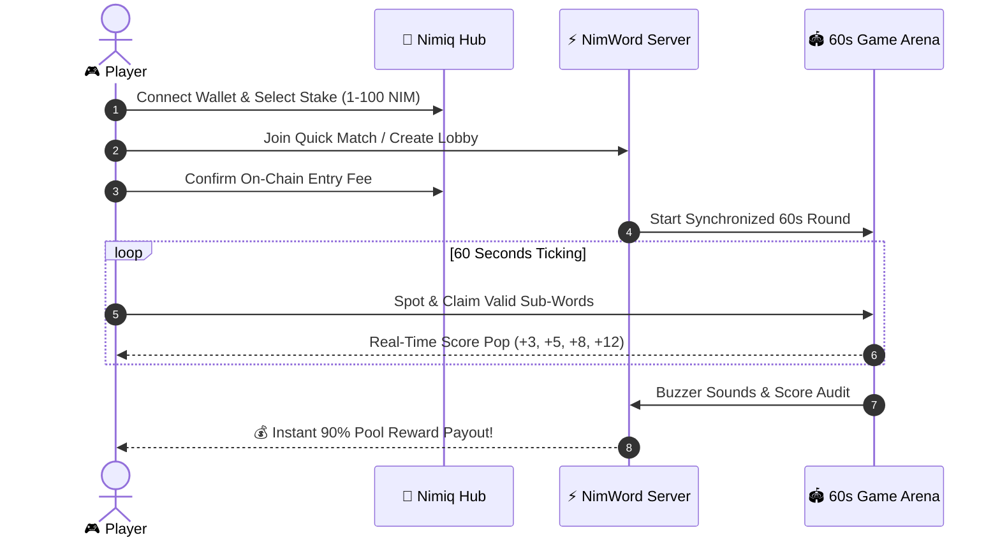

<div align="center">

<br />



# ⚡ NIMWORD ⚡

### *The High-Stakes, Fast-Paced Word Battle on Nimiq*

**Form words. Beat the clock. Take the pot.**

<br />

[](https://nimword.vercel.app)
[](https://nimiq.com)
[](server/tests)
[](LICENSE)

<br />

```
╔══════════════════════════════════════════════════════════════════╗
║  🔥 60 Seconds  •  🪙 Stake 1-100 NIM  •  🏆 90% Win Pool Pot   ║
╚══════════════════════════════════════════════════════════════════╝
```

<br />

</div>

---

## 🎯 What is NimWord?

**NimWord** is a web3 real-time multiplayer anagram battle built natively on the **Nimiq Blockchain**. 

Every match drops you and your opponents into an arena with a shared scrambled word. You have **60 ticking seconds** to spot, tap, and claim as many valid English sub-words as possible. The longer the word, the bigger the score. When the buzzer sounds, **90% of the entire staked pot** is automatically paid out to the winners!

> *Think fast, type faster, and earn real crypto on every win.*

---

## 🚀 Why NimWord Hits Different

| Feature | The Vibe |
| :--- | :--- |
| ⚡ **Lightning 60s Matches** | Pure adrenaline. No waiting around—jump in, scramble, and take the crown. |
| 🪙 **Choose Your Stake** | Stake what you want: **1, 5, 10, 25, 50, or 100 NIM** with instant match lobbies. |
| 💰 **90% Winner Payouts** | 90% of all entry fees go straight into the live prize pool distributed by score. |
| 🦊 **Nimiq Native** | Instant 1-click connect with **Nimiq Hub** + custom unique hexagon avatar identicons. |
| 🎁 **Free Daily Rewards** | Play the **Daily Challenge** once per day to score free NIM and stack win streaks! |
| 🎯 **Solo Practice Arena** | Train your anagram reflexes 24/7 offline or online with zero risk. |

---

## 🕹️ Scoring System

Lock in bigger words to skyrocket up the leaderboard during a round:

```
  🔤 3 Letters ────►  🥉  +3  PTS   (e.g., "NIM", "WIN", "RUN")
  🔤 4 Letters ────►  🥈  +5  PTS   (e.g., "GAME", "WORD", "COIN")
  🔤 5 Letters ────►  🥇  +8  PTS   (e.g., "STAKE", "CHAMP", "BLOCK")
  🔤 6+ Letters ───►  💎  +12 PTS   (MEGA WORD JACKPOT!)
```

---

## 🏆 Match Flow & Architecture



---

## 🎮 Game Modes

### ⚔️ 1. Multiplayer Quick Match
Choose your stake (**1, 5, 10, 25, 50, 100 NIM**), get matched with contenders staking the same tier, and battle for the pooled pot.

### 👥 2. Private Custom Rooms
Generate a private room link with one click and challenge your friends to custom-stake showdowns.

### 📅 3. The Daily Challenge
A fresh daily puzzle drops every 24 hours. Hit the target score before the timer runs out to claim daily NIM rewards and level up your consecutive streak badge!

### 🎯 4. Practice Arena
Sharpen your vocabulary skills and fingers with infinite practice rounds. No wallet or tokens needed.

---

## 💻 Tech Stack Under The Hood

NimWord is built for high speed, zero latency, and seamless web3 user experience:

- **Frontend**: [React 18](https://react.dev/) + [Vite](https://vitejs.dev/) + Modern Vanilla CSS (Design Tokens, Glassmorphism, Responsive Grid)
- **Real-Time Engine**: [Socket.IO](https://socket.io/) (Sub-millisecond state synchronization & heartbeats)
- **Blockchain**: [Nimiq](https://nimiq.com/) (`@nimiq/hub-api`, `@nimiq/identicons`, `@nimiq/utils`)
- **Backend**: [Node.js](https://nodejs.org/) + [Express](https://expressjs.com/)
- **In-Memory Cache**: [Redis](https://redis.io/) (Lobby matchmaking queues & rate limiters)
- **Database**: [PostgreSQL](https://www.postgresql.org/) (Match records, seasonal leaderboards, daily claim states)

---

## 🛠️ Quick Setup for Developers

Want to run NimWord locally or contribute? You can have both client and server running in **under 2 minutes**:

```bash
# 1. Clone the repository
git clone https://github.com/Miracle-Alajemba/nimword.git
cd nimword

# 2. Setup and run backend server (Port 4000)
cd server
npm install
npm run dev

# 3. In a new terminal, setup and run client frontend (Port 5173)
cd ../client
npm install
npm run dev
```

Open **[http://localhost:5173](http://localhost:5173)** in your browser and start playing!

---

## 🧪 Testing Suite

NimWord includes **175+ automated unit and integration tests** testing dictionary derivation, anagram validators, payout splits, anti-cheat limits, and socket matchmaking:

```bash
# Run all server tests
cd server
npm test

# Build production bundle
cd client
npm run build
```

---

## 🤝 Community & Contributing

Contributions, feature suggestions, and bug reports are warmly welcome!
1. Fork the Project
2. Create your Feature Branch (`git checkout -b feature/EpicFeature`)
3. Commit your Changes (`git commit -m 'feat: Add some EpicFeature'`)
4. Push to the Branch (`git push origin feature/EpicFeature`)
5. Open a Pull Request

---

## 📄 License

Distributed under the **MIT License**. See [`LICENSE`](LICENSE) for more details.

<br />

<div align="center">

**[⚡ Play NimWord Live](https://nimword.vercel.app)** &nbsp;•&nbsp; **[🦊 Nimiq Ecosystem](https://nimiq.com)** &nbsp;•&nbsp; **[⭐ Star on GitHub](https://github.com/Miracle-Alajemba/nimword)**

<br />

<sub>Built with 💛 & ⚡ for the decentralized word game revolution.</sub>

</div>
